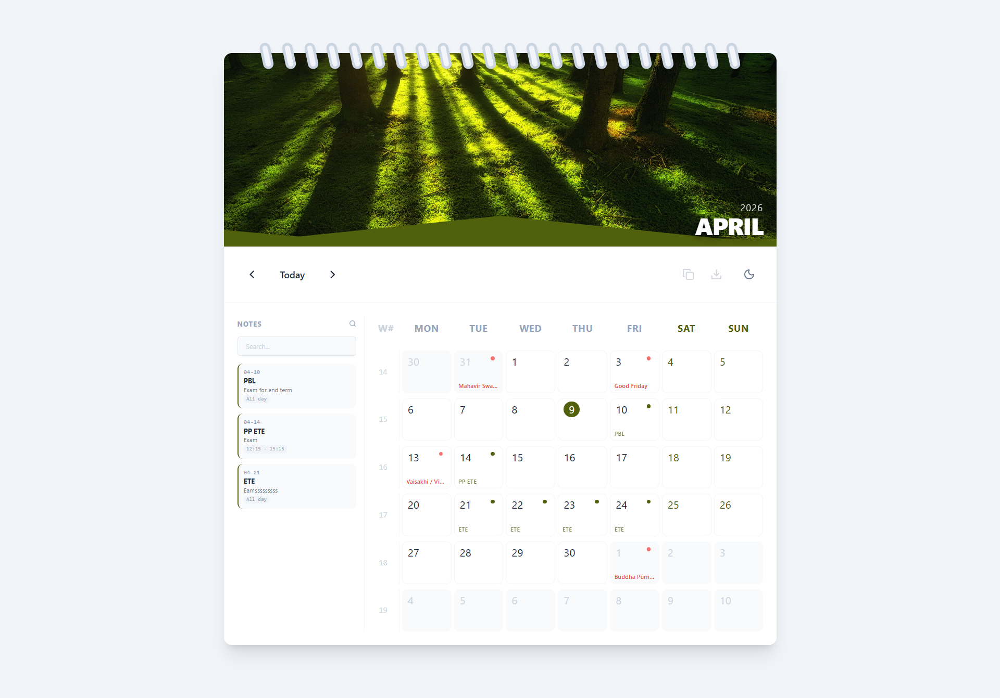

# 🗓️ Wall Calendar 3D

A high-fidelity, interactive 3D calendar application built with React and Vite. This project transforms the traditional calendar experience into a physical "wall calendar" digital twin, featuring smooth vertical 3D page-flip transitions, dynamic layout adjustments, and rich event management.

 *(Placeholder: Add your screenshot here)*

## ✨ Key Features

- **3D Vertical Flip Transition**: A native CSS 3D animation (`perspective`, `rotateX`) that mimics a real wall calendar page turn with depth and realistic shadows.
- **Dynamic Color Extraction**: Automatically samples colors from the month's hero image using a custom hook (`useDominantColor`) to theme the UI highlights, date ranges, and notes.
- **Rich Note Management**: 
  - Create, edit, and delete notes for any day.
  - Drag-and-drop notes between days.
  - Interactive timeline view in a responsive sidebar.
- **Smart Date Selection**: Multi-day range selection with immediate visual feedback.
- **Responsive Architecture**: Fully optimized for both desktop (sidebar timeline) and mobile (horizontal strip view).
- **Dark Mode Support**: Deep integration with system settings and manual toggle.
- **Holiday & Progress Tracking**: Integrated holiday highlighting and "days remaining" tooltips.

## 🛠️ Tech Stack

- **Framework**: [React 18](https://reactjs.org/)
- **Build Tool**: [Vite](https://vitejs.dev/)
- **Styling**: [Tailwind CSS](https://tailwindcss.com/)
- **Icons**: [Lucide React](https://lucide.dev/)
- **Animations**: Native CSS 3D Transforms & Keyframes
- **Feedback**: [Canvas Confetti](https://www.npmjs.com/package/canvas-confetti)

## 🚀 Getting Started

### Prerequisites

- [Node.js](https://nodejs.org/) (v16.14 or higher)
- npm or yarn

### Installation

1. **Clone the repository**:
   ```bash
   git clone https://github.com/your-username/calendar.git
   cd calendar
   ```

2. **Install dependencies**:
   ```bash
   npm install
   ```

3. **Start the development server**:
   ```bash
   npm run dev
   ```

4. **Build for production**:
   ```bash
   npm run build
   ```

## 📂 Project Structure

- `src/components/`: Core UI components (`WallCalendar`, `HeroImage`, `CalendarGrid`, etc.)
- `src/hooks/`: Custom state logic (`useDominantColor`, `useNotes`, `useDateRange`)
- `src/utils/`: Helper functions and holiday data.
- `src/app/globals.css`: Custom 3D perspective and flip animation definitions.

## 🤝 Contributing

Feel free to open issues or submit pull requests to improve the 3D physics, color sampling accuracy, or feature set!

---
*Built with ❤️ by Ayu270*
